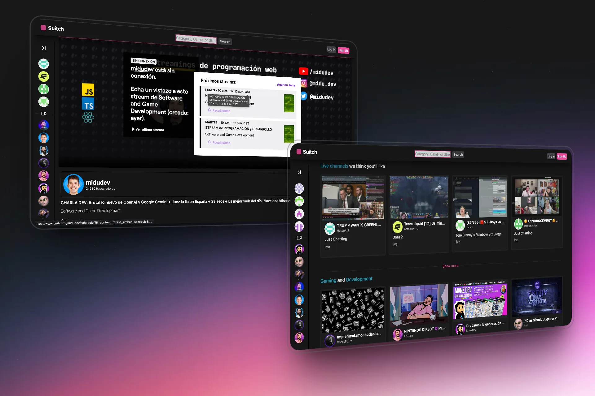

# 🎮 Suitch 👾 - Plataforma de Streaming

📹 Suitch fue un excelente proyecto de práctica con el objetivo de simular la plataforma de Twitch 🎮, mediante la creación de componentes y la implementación de responsividad. Hasta ahora, el proyecto te permite buscar a cualquier streamer y ver su contenido.

La UI está inspirada en una web de Edu Calvo ✨. Aún falta mejorar el responsive, algo en lo que trabajaré para adaptarlo mejor a pantallas más pequeñas, y por supuesto, agregar inicio de sesión con Twitch.

En verdad, hace un año no me imaginaba cómo hacer esto, y estoy disfrutando mucho el desarrollo de esta simulación de Twitch 🚀.



## 🛠️ Tecnologías Utilizadas

- React.js
- Vite
- Tailwind CSS
- Twitch API
- React Router

## 🚀 Instalación

1. Clona el repositorio:
```bash
git clone https://github.com/tu-usuario/suitch.git
```

2. Instala las dependencias:
```bash
cd suitch
pnpm install
```

3. Crea un archivo `.env` en la raíz del proyecto con las siguientes variables:
```env
PUBLIC_URL_TWITCH=https://api.twitch.tv/helix/streams
PUBLIC_TWITCH_TOKEN=tu_token_de_twitch
PUBLIC_URL_TWITCH_SEARCH=https://api.twitch.tv/helix/users
PUBLIC_CLIENT_ID=tu_client_id_de_twitch
```

4. Inicia el servidor de desarrollo:
```bash
pnpm run dev
```

## 📦 Estructura del Proyecto

```
suitch/
├── src/
│   ├── components/
│   │   ├── Header.jsx
│   │   ├── Footer.jsx
│   │   ├── Channels.jsx
│   │   ├── Perfiles.jsx
│   │   └── ...
│   ├── hooks/
│   │   ├── useStream.jsx
│   │   └── useSearch.jsx
│   ├── logic/
│   │   └── respuesta.js
│   ├── services/
│   │   └── apiTwitch.js
│   └── App.jsx
├── public/
│   └── preview/
├── .env
└── package.json
```

## 🔑 Configuración de Variables de Entorno

Para que la aplicación funcione correctamente, necesitas configurar las siguientes variables de entorno en tu plataforma de despliegue (por ejemplo, Netlify):

- `PUBLIC_URL_TWITCH`
- `PUBLIC_TWITCH_TOKEN`
- `PUBLIC_URL_TWITCH_SEARCH`
- `PUBLIC_CLIENT_ID`


## 📝 Licencia

Este proyecto está bajo la Licencia MIT - ver el archivo [LICENSE.md](LICENSE.md) para más detalles.

## 👤 Autor

Alan San  - [@alanpro._](https://www.linkedin.com/in/devsan11/)

## 🙏 Agradecimientos
- [Midudev](https://midu.dev/) 💜

## 📚 Cosas a las que me enfrente y aprendi 

- Aprender a usar la twitch api
 * usar las cabeceraz en las apis
 * obtener el token de twitch

- usarCreateContecxt() en React
  * es crear un componenete con contexto en ele estado para que este componenete envuelba los {children} los componenetes que envolvasmo con este componente Padre, muy interesante la forma de compartir interactividad con el estado de un componente a otro. 
  Uso: por ejemplo al colapsar o expanir la Barra lateral izquierda de Recommended Channels reacciona los demas componenets de aceurdo a ese estado. 

  - Astro pages (Dinamicas)    
    * Las utilizamos para crear el perfil dinamico de cada streamer buscado o seleccionado.
    descubrimos que para usar esto dever darle a astro toda la informacion previe de las paginas que vas a renderizar de forma dinamica, esto esta vien si no hay muchos elementos. de echo este fue uno mis
     ## mayores retos
     - para logralo:
      twitch limita la info obtenida con cada curl que hagas y para obtener el perfil de cada streamer se debe hacer una peticion por cada streamer para obtener su ID y con su ID hacer una peticion nueva con otra url diferente mas la id y asi obtener el perfil completo de cada streamer para su informacion.
